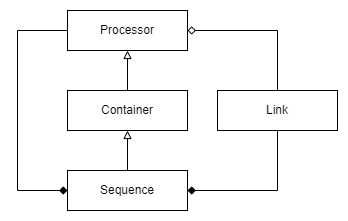

# cppbase
C++17 cross-platform header-only library providing common features for C++ projects, such as variant, logging, serialization, task sequence, thread pool, TCP/UDP client and server, etc.

## Features
### Variant
**Variant** allows to store data of any type and convert between these types transparently. The current implementation is based on [rttr](https://github.com/rttrorg/rttr) to get Runtime Type Reflection. We also implemented a userful feature called **PropertyPath**, which defines a chained PropertyInfos that can be used to access a property of a type. Refer to [tests/common/VariantTests.cpp](tests/common/VariantTests.cpp) for examples.
### Logging
**Logging** is a wrapper on [spdlog](https://github.com/gabime/spdlog) and integrated [spdlog_setup](https://github.com/guangie88/spdlog_setup) for static logging configuration. User can create a config file (specified in spdlog_setup) and put it under `config/log.conf` of the current working directory to configure logging. To get the logger for the current module, just call `cppbase::logging::GetLoggerForCurrentModule()` and make sure to define `MODULE_NAME` at compile time.
### Serialization
**Serialization** internally uses [cereal](https://github.com/USCiLab/cereal) to serialize and deserialize data. [Serializer](common/Serializer.h) provides a set of convenient functions to serialize and deserialize objects to/from a string or a file in binary format, which can be easily changed to JSON or XML.
### Sequence
**Sequence** is a set of classes ([Processor](sequence/Processor.h), [Sequence](sequence/Sequence.h), [Link](sequence/Link.h)) that allows user to execute a series of processing unit. It internally uses [taskflow](https://github.com/taskflow/taskflow) as the execution engine. Together with **Variant**, it provides an easy way to create a sequence that contains multiple processors with different functionalities to finish complex tasks. Refer to [tests/common/SequenceTests.cpp](tests/sequence/SequenceTests.cpp) and [tests/sequence/ProcessorTests.cpp] for examples.

### Thread Pool
There are two threadpools in this library: **ThreadPool** and **ForkJoinPool**. The former is based on https://github.com/progschj/ThreadPool.git and the latter is based on [asio's fork join pool](https://raw.githubusercontent.com/boostorg/asio/develop/example/cpp14/executors/fork_join.cpp).
### TCP/UDP Client and Server
Our implementation uses non-boost version [asio](https://github.com/chriskohlhoff/asio) internally.
### Others
There are other features that are commonly used in C++ projects, such as [BlockingQueue](common/BlockingQueue.h), [Encoding](common/Encoding.h), [FileSystem](common/FileSystem.h) (wraps up C++17 std::filesystem), [Semaphore](common/Semaphore.h), [Timer](common/Timer.h), [Uuid](common/Uuid.h).

**Please create issues if you find any bugs or have any suggestions.**

## Thirdparty libraries
[thirdparty/README.md](https://github.com/o-netusa/cppbase/tree/master/thirdparty/README.md)

## Setup clang-format in QtCreator
* Enable "Help->Plugin->Beautifier" and restart QtCreator
* Add the source code directory in "Tools->Options->Beautifier->Clang-Format" and choose command and style
* Setup hotkeys from "Tools->Options->environment->keyboard->ClangFormat"
